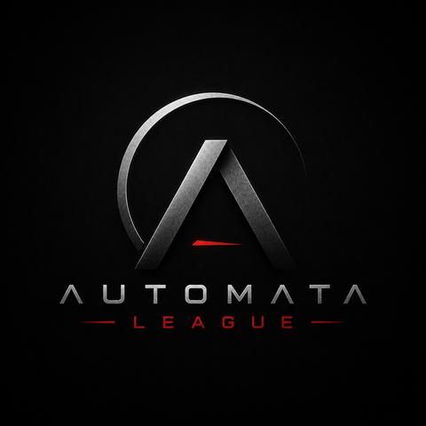
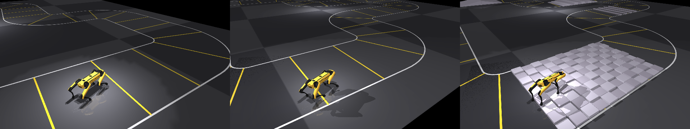

<p align="center">
  
</p>

# Automata League Parkour

The parkour competition environment of the **Automata League**: a legged robot runs a winding
circuit in [MuJoCo](https://mujoco.org/), either **clearing obstacles** to reach the finish or
**racing the flat course** for the fastest lap. Boston Dynamics **Spot** and Unitree **Go1** ship
as example robots; plug in your own the same way. The examples train with
[TorchRL](https://github.com/pytorch/rl) PPO, GPU parallel via
[MuJoCo Warp](https://github.com/google-deepmind/mujoco_warp); any other TorchRL agent works the
same way.

Sibling of [automataleague-sumo](https://github.com/AutomataLeague/automataleague-sumo), whose
architecture this mirrors.

## Setup

```bash
uv sync                              # core: environment building, rendering, task logic + tests
uv sync --extra train --extra gpu    # adds torchrl, hydra, wandb, MuJoCo Warp (GPU box)
```

Headless rendering needs a GL backend: `MUJOCO_GL=egl`.

## The parkour environment

<p align="center">
  
</p>

<p align="center">
  <sub>A trained policy on the circuit: starting a lap, carrying speed through a bend, and the
  paving field at level 2. Yellow lines are checkpoint gates, white is the corridor boundary;
  stray past it and the episode ends.</sub>
</p>

The task lives in `automataleague_parkour/envs/parkour/`. Environments are named and versioned in
a registry (`automataleague_parkour/envs/registry.py`) and imported by id.

| Environment | Track | Levels | Obstacles | Domain randomization |
|---|---|---|---|---|
| **`parkour-1`** | winding circuit (closed loop) | 5 &nbsp;(0 flat to 4 hardest) | paving, hurdle, staircase, ramp, side incline | Yes &nbsp;(per-episode obstacle scaling) |

```python
from automataleague_parkour import make_env, list_environments

list_environments()                                       # [EnvSpec(env_id="parkour-1", ...)]

env = make_env("parkour-1", robot="spot", level=0, backend="cpu")               # render / eval
env = make_env("parkour-1", robot="spot", level=2, backend="warp", num_envs=2048)  # training
```

* **`level` 0 is flat**: the winding loop and nothing else, and the setting for racing. Levels
  **1 to 4** add obstacles of rising height and widen the action range to match.
* **Two games on the same circuit.** *Complete* (default) reaches the finish, rewarded by progress
  plus a finish bonus. *Race* (`race_mode=true`) is a time trial for the fastest lap.
* **One observation everywhere**: `[proprio 49 | height_scan 12 | track_preview 17] = 78`. Both
  sensors are on at every level, so the policy always sees the terrain ahead and the corridor
  ahead, and any checkpoint warm-starts any run.
* Override any config field inline, e.g.
  `make_env("parkour-1", robot="spot", race_mode=True, track_perception="none")`.

<details>
<summary><b>The reward</b>: terms, weights, and why the racing preset differs</summary>

<br>

`RewardConfig` in `envs/parkour/config.py`, combined in `rewards.py`. Unlike our sibling sumo
project these weights are **not** on a common whole-episode scale, so read the `kind` column
before comparing them.

| term | what it pays for | kind | weight |
|---|---|---|---|
| `forward` | along-track speed toward the goal, saturating at `target_speed` (1.0 m/s) | per step | 1.5 |
| `progress` | distance closed toward the next gate (potential shaping) | per step | 2.0 |
| `checkpoint` | reaching a gate | one-off | 10.0 |
| `success` | reaching the finish | terminal | 100.0 |
| `alive` | per-step survival bonus; **negative makes it a time cost** | per step | 0.0 |
| `upright` / `height` | posture keeping, small so standing still never wins | per step | 0.05 each |
| `action` / `joint_vel` | regularizers (magnitude, smoothness) | per step | 0.01 / 0.001 |
| `fall` | falling | one-off penalty | 10.0 |
| `off_path` | straying past `half_width`; also terminates | one-off penalty | 25.0 |
| `feet_air_time` | swing duration per foot, for a clean gait instead of a shuffle | per step | 0.0 (off) |

`forward` is the dense driver that makes walking emerge, and **its saturation matters**: above
`target_speed` it is flat, so nothing here pushes a policy faster. That is what the racing preset
changes: it zeroes `progress` and `checkpoint`, sets `alive` negative so every step costs time,
and raises `success` to 500 so a finished lap still clears the accumulated cost. Racing speed
comes from the clock, not from a shaping term.

`success` must beat `|alive| × max_episode_steps` or finishing is net-negative and the optimal
policy is to stall while every training curve still looks like progress.
`tests/test_reward_balance.py` asserts this for every level.

</details>

## Training

Entry points in `examples/`, run from the repo root. Hydra config is `examples/config_ppo.yaml`;
any value can be overridden on the command line. Checkpoints land in `checkpoints/<run>/`, and
each stage drops an eval video in `videos/`.

Every run writes `checkpoints/<run>/metrics.jsonl` — episode return, success rate, episode
length, losses, one row per batch — **whether or not a logger backend is configured**. Plot it
with `tools/plot_curves.py`. Name runs `<algo>_<setting>_s<seed>` and it groups seeds
automatically into a mean with a 95% CI band; without several seeds per configuration a gap
between two algorithms cannot be told from run-to-run variance.

```bash
uv run python examples/ppo_single.py env.course.level_difficulty=0   # flat
uv run python examples/ppo_single.py env.course.level_difficulty=2   # one obstacle level
uv run python examples/ppo_curriculum.py                             # levels 1-4 in sequence
uv run python examples/ppo_race.py                                   # flat time trial
```

On the shipped defaults at 30M frames per level, scored over 6 noisy starts:

| flat | paving | hurdle | staircase | ramp | racing |
|---|---|---|---|---|---|
| 6/6 (31.5 s) | 5/6 | 3/6 | 6/6 | 4/6 | 6/6 (23.0 s) |

> **[training-recipe.md](training-recipe.md)** is the full walkthrough: the staged recipe, the
> gate to check before spending the next block of GPU time, and the things that went wrong.

<details>
<summary><b>What actually moves the numbers</b>: measured, one variable at a time</summary>

<br>

On level 1, 6 noisy starts each:

| setting | finishes |
|---|---|
| 10M frames, DR off, 1000-step episodes | 1/6 |
| \+ `randomize_obstacles=true` | 3/6 |
| \+ 2000-step episodes instead | 3/6 |
| **30M frames** | **6/6** |

All three are defaults now, not flags to remember:

* **Frames are the dominant lever.**
* **Obstacle domain randomization** scales each obstacle per episode by `U(0.5, 1.5)` around the
  level's nominal height, an implicit within-level curriculum. That is how a policy gets a
  first success to learn from. Evaluation forces the factor to 1.0, so scores stay on the
  nominal course.
* **Episodes must be long enough to contain a lap** (2000 steps flat, 3000 on obstacles). At the
  old flat 1000 every episode was truncated ~500 steps short of a ~1465-step lap, so the finish
  bonus was never paid and the last third of the course was never trained.

The curriculum warm-starts each level from the previous level's best checkpoint. Which levels,
per-level frame budget and action scale live under `curriculum:` in the config.

</details>

## Racing

A time trial on the same circuit: fastest lap, not just reaching the finish.
`examples/ppo_race.py` uses `examples/config_race.yaml`: `race_mode` navigation (scored on
along-track speed and gate crossings, so the agent finds the time-optimal line instead of dipping
to each gate centre), a lap-time reward, and a wider action scale.

**Track perception** (`env.course.track_perception`) is what lets a policy plan a line:
`boundary` (the default) gives the left and right corridor edges at each lookahead so it can cut
the apex; `centerline` gives the midline; `none` is blind, for ablations.

Zeroing each block on the trained racer's own trajectory shows how much it relies on each:

| block zeroed | action change | rollout |
|---|---|---|
| `height_scan` | 1.4 % | 4/4 finishes |
| `track_preview` | **29.0 %** | **0/4 finishes** |

Without the corridor ahead the racer stops finishing at all. The height scan barely registers
on a flat course, which is what you would expect with no terrain to scan.

## Watch and evaluate a policy

```bash
MUJOCO_GL=egl uv run python tools/render_policy.py checkpoints/race_L0/ppo_best.pt -o lap.mp4
MUJOCO_GL=egl uv run python tools/render_policy.py CKPT --camera drone_side   # chase|top|...

MUJOCO_GL=egl uv run python tools/rank_series.py checkpoints/race_L0   # rank a whole run
uv run python tools/plot_curves.py --out renders/curves                # learning curves

uv run python tools/eval_policy.py checkpoints/race_L0/ppo_best.pt --seeds 8
#   finished 8/8 starts
#   lap time  median 22.9s  best 22.4s  [...]
```

Each start uses the same Gaussian noise training resets with, and a lap counts as finished on the
env's terminal outcome. **This is the ranking signal to trust**. A single greedy eval rollout
disagreed with it repeatedly here. Both run on the CPU backend, so no GPU is needed.

## Simulation speed

Throughput of the batched MuJoCo Warp env, in total environment steps per second across all
parallel envs. It climbs with `num_envs` as parallelism amortizes the fixed cost of each step.

| num_envs | 512 | 1024 | 2048 | 4096 |
|---|---|---|---|---|
| observed env steps/s | 10k to 60k | 10k to 85k | 12k to 105k | 13k to 110k |

The spread is hardware. Run `tools/benchmark_env.py` for your own number; it prints the sensor
config it measured, since the observation is 49 columns with both sensors off and 78 with both on.
The single-env CPU backend runs at roughly **1.2k steps/s**.

<details>
<summary><b>Adding a custom robot</b>: the RobotSpec contract, worked through Go1</summary>

<br>

A robot is a `RobotSpec` (`automataleague_parkour/robots/base.py`), the whole contract a task
needs. Observation and action sizes are **derived from the joint count**, so a robot with a
different number of legs or joints plugs into the same env, reward and PPO code with no changes
to any of them.

Unitree **Go1** is the worked example, and it is nothing like Spot: half the standing height
(0.27 m vs 0.46 m), a different joint naming scheme, a stock Menagerie model. Three steps:

**1. Vendor the model** under `assets/<name>/`, keeping the upstream `LICENSE`.

> One asset fix was needed for Go1: Menagerie sets a default geom `margin="0.001"`, which the Warp
> backend rejects (`non-zero margin with MULTICCD`). Removing that one attribute was the only edit
> to the model. Worth knowing before you vendor any Menagerie robot.

**2. Write the factory** in `automataleague_parkour/robots/<name>.py`, reading every field off the
model's own `home` keyframe and docs; see `unitree_go1.py`. Two things matter most:

* **Joint order is the contract.** `joint_names`, `actuator_names` and `home_joint_qpos` must line
  up index for index and match the actuator order in the MJCF. Get it wrong and the policy drives
  the wrong joint.
* **`home_joint_qpos` is the stance the policy perturbs around** (`q_target = home + action_scale
  * action`), so a good standing pose is what makes locomotion learnable.

`foot_geom_names` is optional: name the foot geoms and the foot air-time gait reward can find
them.

**3. Register it** in `robots/__init__.py`: `ROBOTS = {"spot": make_spot, "go1": make_go1}`.

That is all. Now use it anywhere Spot goes, including `examples/ppo_single.py env.robot=go1`.
The PPO networks size themselves from the env specs, so no training code changes. Different
robots often want a different *reward* though: Go1 walks cleanly once the foot air-time term is
on, which is what the `reward_fn` hook is for.

</details>

<details>
<summary><b>Adding a custom reward</b>: retune, replace, or extend</summary>

<br>

Weights are a `RewardConfig` (`envs/parkour/config.py`); terms are combined in `compute_reward`
(`envs/parkour/rewards.py`).

**Retune existing terms** (no code):

```python
env = make_env("parkour-1", robot="spot",
               reward_cfg=RewardConfig(forward=2.0, checkpoint=5.0, alive=-0.01))
```
```bash
uv run python examples/ppo_single.py env.reward_weights.forward=2.0
```

**Replace it entirely** by passing `reward_fn` to `make_env`. It takes the same arguments as
`compute_reward` and returns `(reward, components)`. This lets the reward travel with the robot
while the env stays fixed:

```python
def my_reward(state, prev_dist, cur_dist, reached_intermediate, reached_finish,
              fell, off_path, action, nominal_height, rc, forward_vel=None):
    reward = rc.progress * (prev_dist - cur_dist) + rc.success * reached_finish.float()
    return reward, {}

env = make_env("parkour-1", robot="go1", reward_fn=my_reward)
```

**Add a term to the default** by adding a weight field to `RewardConfig`, computing it in
`compute_reward` and add it to the returned sum, then expose it under `reward_weights` in
`examples/config_ppo.yaml`.

Whatever you change, keep `success` above `|alive| × max_episode_steps`
(`tests/test_reward_balance.py`), or finishing becomes net-negative and the policy learns to
stall while the curve still looks healthy.

</details>

## Tests

```bash
uv run pytest -m "not gpu"            # CPU suite: env, observations, rewards, navigation, preview
uv run pytest -m gpu                  # the batched MuJoCo Warp backend (needs CUDA + mujoco-warp)
```

The task logic is written in tensors, so the task-logic tests run on a bare `uv sync` with no
training stack. Training-integration tests need `--extra train`; `gpu`-marked tests need
`--extra gpu`.

## Roadmap

* **A policy contract**, so a policy this repo did not train can be evaluated. Our sibling sumo
  project has one and parkour does not.
* **A leaderboard** over the eval results, making runs comparable across training runs rather
  than only within one.
* **Level 2 (hurdle) sits at 3/6** while the harder staircase above it scores 6/6. The hurdle is
  the outlier and is not yet understood.

## Licence

Apache-2.0, see [LICENSE](LICENSE). Vendored robot models keep their upstream licences.

## Credits

* Spot model © Boston Dynamics, from MuJoCo Menagerie (Apache 2.0). See `assets/spot/LICENSE`.
* Go1 model © Unitree Robotics, from MuJoCo Menagerie (BSD 3-Clause). See `assets/unitree_go1/LICENSE`.
